# Hello, my name is `Tan`. 👋 

### I'm an Information Assurance student at [FPT University](https://fpt.edu.vn/) and aspiring to become a SOC Analyst specializing in Blue Team and Cyber Defense. 

<h3 align="center">hoangtan09-afk@github ~ $ whoami</h3>

<table align="center">
<tr>
<td valign="top" align="center"></td>
<td valign="top" align="center"></td>
</tr>
</table>

- 🌱 Recently, I've been working on developing my skills in **[Blue Team Level 1](https://www.securityblue.team/certifications/blue-team-level-1)**, SOC investigation, network traffic analysis, digital forensics, and Python automation.
- 👯 I want to collaborate with other cybersecurity learners and content creators (e.g., for technical write-ups, security projects, or GitHub repositories).  
I am looking for motivated individuals with experience in topics such as cybersecurity, SOC operations, digital forensics, threat hunting, malware analysis, programming, and incident response.  
Some platforms and communities I follow are **[Security Blue Team](https://www.securityblue.team/)**, **[CyberDefenders](https://cyberdefenders.org/)**, **[Blue Team Labs Online](https://blueteamlabs.online/)**, **[TryHackMe](https://tryhackme.com/)**, **[Hack The Box](https://www.hackthebox.com/)**, and **[picoCTF](https://picoctf.org/)**.  
If you're interested in learning cybersecurity, creating technical content, solving security labs, or building Blue Team projects, then feel free to contact me at hohoangtan2k5@gmail.com.

## 🌐 Connect with me:
   

# 💻 Languages and Tools:
     

<!-- Proudly created with GPRM ( https://gprm.itsvg.in ) -->
